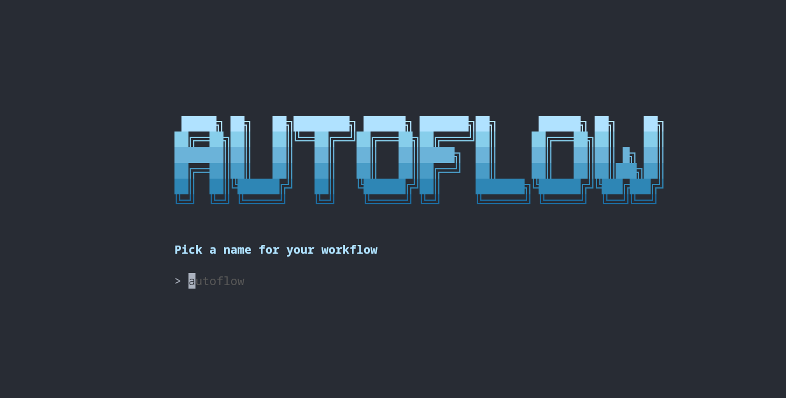
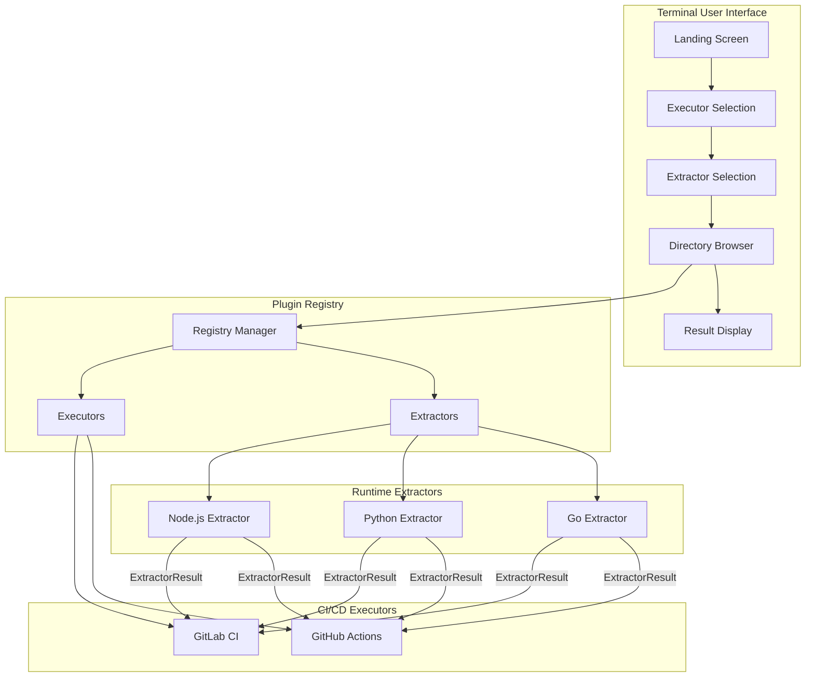
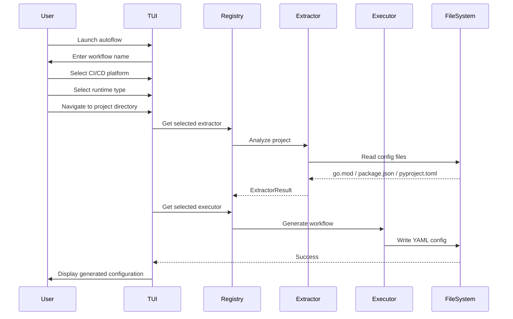

<div align="center">
  <h1>AutoFlow</h1>
  <p><strong>Automated CI/CD Workflow Generator</strong></p>

  <a href="https://github.com/zraisan/autoflow/releases"></a>
  <a href="https://pkg.go.dev/github.com/zraisan/autoflow?tab=doc"></a>
  <a href="https://goreportcard.com/report/github.com/zraisan/autoflow"></a>
</div>

<br>



AutoFlow is a powerful CI/CD workflow automation tool that automatically generates pipeline configurations for various CI/CD platforms. Built with Go using the Charm stack (Bubble Tea and Lipgloss), AutoFlow features an interactive Terminal User Interface that guides you through detecting your project's runtime and generating the appropriate workflow files.

## Features

- **Automatic Runtime Detection** - Detects Go, Python, and Node.js projects automatically
- **Multi-Platform Support** - Generates configurations for various CI/CD platforms
- **Interactive TUI** - Beautiful terminal interface for easy configuration
- **Smart Defaults** - Intelligently selects Docker images, package managers, and scripts
- **Extensible Architecture** - Plugin-based registry system for adding new extractors and executors

## Architecture



## Workflow



## Installation

### From Source

```bash
# Clone the repository
git clone https://github.com/yourusername/autoflow.git
cd autoflow

# Build the binary
go build -v ./...

# Run AutoFlow
./autoflow
```

### Requirements

- Go 1.21 or later

## Usage

Simply run `autoflow` to launch the interactive TUI:

```bash
./autoflow
```

You'll be guided through:

1. **Workflow Name** - Enter a name for your CI/CD workflow
2. **Platform Selection** - Choose your target CI/CD platform
3. **Runtime Selection** - Select your project's runtime (Go, Python, or Node.js)
4. **Directory Selection** - Navigate to your project directory
5. **Review & Save** - View the generated configuration and save it

## Supported Runtimes

### Go Projects

- Detects version from `go.mod`
- Generates `golang:version` Docker image
- Includes `go build` and `go test` commands
- Adds linting support where available

### Python Projects

- Detects version from `.venv` or system Python
- Supports multiple package managers:
  - **pip** - `requirements.txt`
  - **uv** - `pyproject.toml` with uv config
  - **poetry** - `pyproject.toml` with poetry config
- Extracts linting and testing commands from `pyproject.toml`

### Node.js Projects

- Parses `package.json` for configuration
- Detects version from `.nvmrc` or `engines` field
- Supports multiple package managers:
  - **npm** - `package-lock.json`
  - **pnpm** - `pnpm-lock.yaml`
  - **yarn** - `yarn.lock`
  - **bun** - `bun.lockb`
- Normalizes npm scripts (lint, test, build, deploy)

## Generated Configurations

### GitHub Actions

AutoFlow generates `.github/workflows/{name}.yml` with:

- Triggers on push to main branch
- Runs on `ubuntu-latest`
- Platform-specific setup actions (`setup-node`, `setup-go`, `setup-python`)
- Extracted build and test scripts

Example output:

```yaml
name: ci
on:
  push:
    branches: [main]
jobs:
  build:
    runs-on: ubuntu-latest
    steps:
      - uses: actions/checkout@v4
      - uses: actions/setup-go@v5
        with:
          go-version: "1.21"
      - run: go build -v ./...
      - run: go test -v ./...
```

### GitLab CI

AutoFlow generates `.gitlab-ci-{name}.yml` with:

- Docker image based on detected runtime
- Organized stages for build and test
- Extracted scripts for each job

Example output:

```yaml
image: golang:1.21
stages:
  - build
  - test
build:
  stage: build
  script:
    - go build -v ./...
test:
  stage: test
  script:
    - go test -v ./...
```

## Contributing

Contributions are welcome! Here's how you can help:

### Adding a New Extractor

1. Create a new file in `extractors/` (e.g., `rust.go`)
2. Implement the `Extractor` interface:

```go
type RustExtractor struct{}

func (e *RustExtractor) Extract(path string) registry.ExtractorResult {
    // Read project config file
    // Extract version and scripts
    return registry.ExtractorResult{
        Runtime:        "rust",
        Version:        version,
        Image:          "rust:" + version,
        PackageManager: "cargo",
        Scripts:        scripts,
    }
}
```

3. Register in the registry

### Adding a New Executor

1. Create a new file in `executors/` (e.g., `circleci.go`)
2. Implement the `Executor` interface
3. Generate the appropriate configuration format
4. Register in the registry

## License

MIT License - see [LICENSE](LISENCE) file for details.
